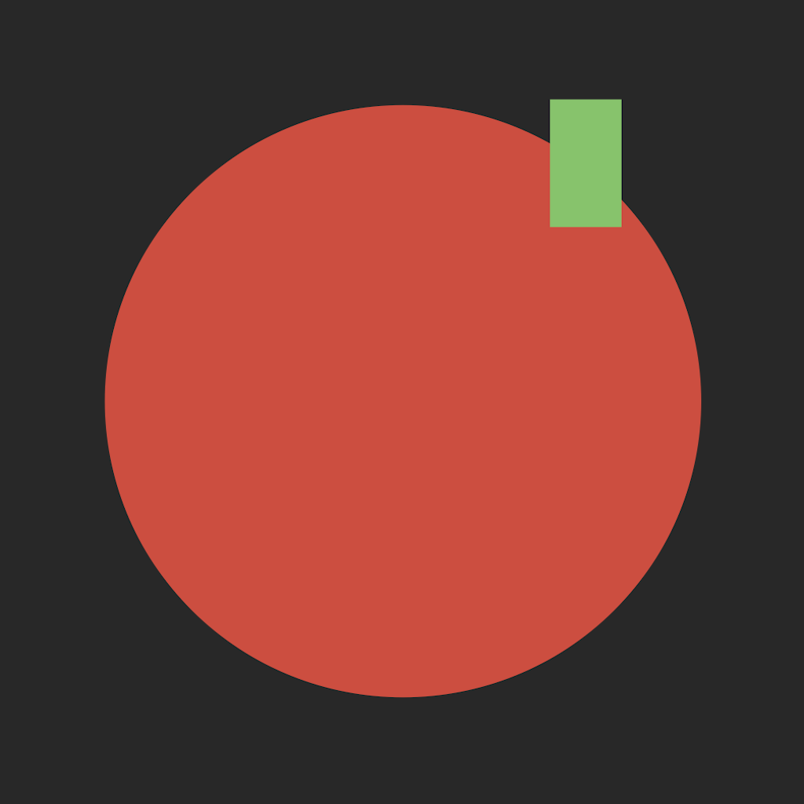

#  Pomodoro Minimalista

A distraction-free Pomodoro timer — for people who procrastinate on their productivity apps.

[In AppStore](https://apps.apple.com/us/app/pomodoro-minimalista/id6756944449)

Built for Apple Watch with iOS companion app.

## The Problem
Many productivity apps often include extensive customization, detailed analytics, and streak tracking. These additions can create decision fatigue and become distractions.

This app takes a different approach: minimal interface, essential functionality only.

## The Solution
A timer designed to get out of your way:
- **One tap to start** — no configuration required, default is 25 minutes 
- **Haptic alerts on your wrist** — works in silent mode, no need to pick up your phone
- **Visual progress** - simple live ring with countdown

## Design Philosophy

**Minimalism as intentional design, not a limitation.** 
- No graphs or streaks — prevents obsessing over patterns
- No complex setup — remove barriers to starting
- No gamification — attention stays on work, not the app

## Features
**On Apple Watch:**
- Live circular progress ring during session
- One-tap start
- Digital Crown to adjust session duration (1-60 min)
- Haptic + notification alerts when session ends
- Minimal stats - daily and total session counts

**On iPhone/iPad:**
- Session duration settings
- Session statistics

Sync across devices

## Tech Stack
**Core:**
- Swift & SwiftUI

**Sync & Persistence:**
- WatchConnectivity (Watch ↔ iPhone sync)
- iCloud Key-Value Store (cross-device persistence)
- UserDefaults (local storage)

**Other:**
- UserNotifications (background alerts)
- Mixpanel (event analytics)
